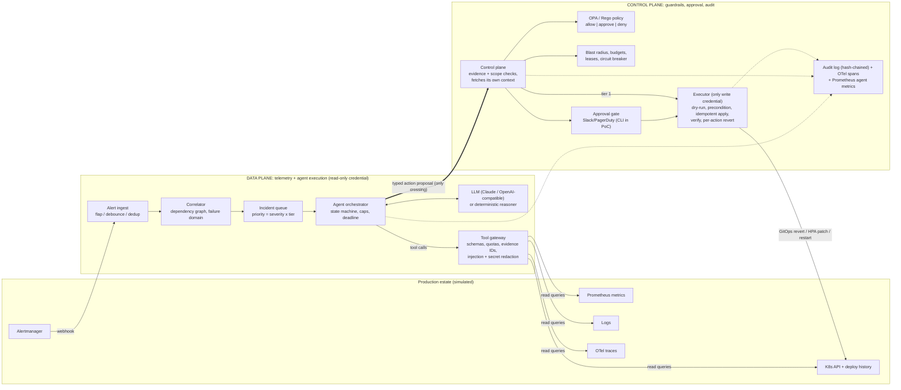
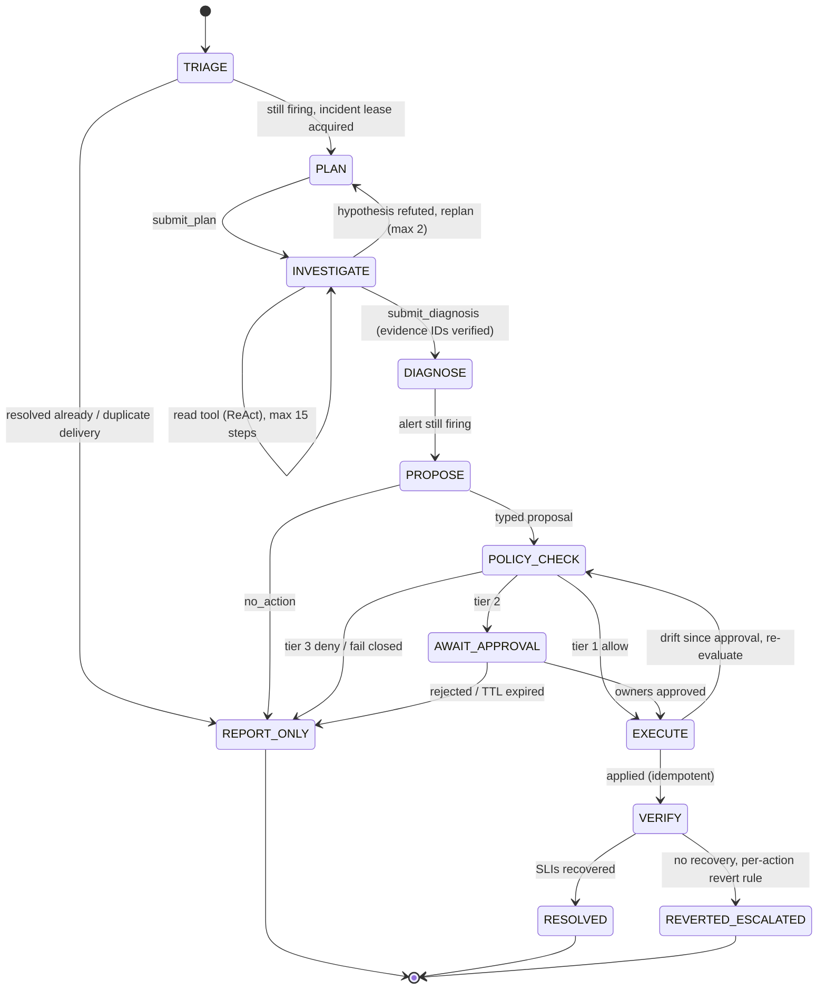
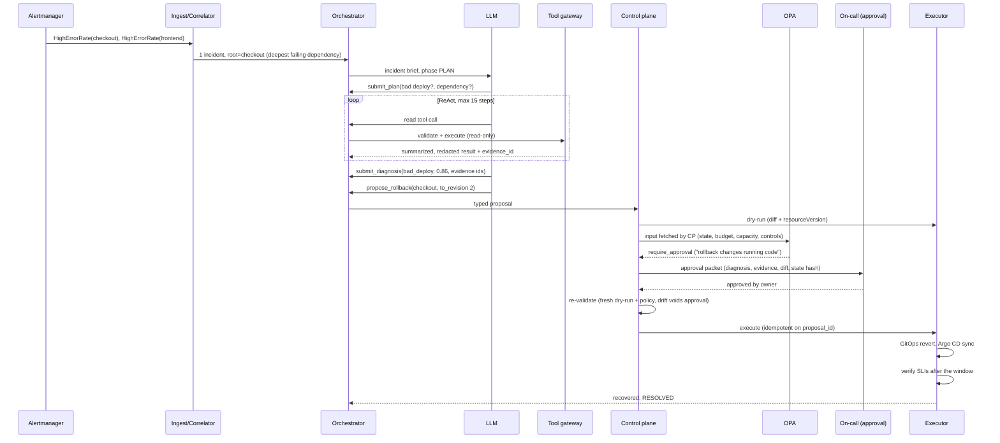

# ASAP Architecture

> **Thesis.** The LLM is an *untrusted planner*. It may read telemetry freely and may *propose* one of four remediations. It can never execute anything. A deterministic control plane (policy-as-code, dry-run, blast radius, human approval, budgets) decides, and a separate executor holding the only write credential acts, then verifies.

## Key decisions

Each decision, with the alternatives considered and the costs accepted, is recorded as an ADR in [docs/adr](docs/adr/README.md).

| # | Decision | Main trade-off accepted |
|---|---|---|
| [0001](docs/adr/0001-llm-proposes-control-plane-decides.md) | The LLM only proposes; a deterministic control plane decides and acts | More components; the agent can't act even when it is obviously right |
| [0002](docs/adr/0002-plan-and-execute-with-bounded-react.md) | Plan-and-Execute with bounded ReAct and a replan edge | One extra LLM call per incident |
| [0003](docs/adr/0003-custom-state-machine-over-agent-framework.md) | Custom state machine rather than LangGraph / AutoGen / CrewAI | We own persistence and resumption |
| [0004](docs/adr/0004-policy-as-code-in-rego.md) | Policy in OPA/Rego, fail-closed evaluation | Evaluator dependency; no engine means no actions |
| [0005](docs/adr/0005-fail-open-detection-fail-closed-execution.md) | Detection fails open, execution fails closed; ASAP beside paging | Less automation during provider outages |
| [0006](docs/adr/0006-linearizable-leases-and-budgets.md) | Linearizable leases and budgets; deny under partition | Store outage halts remediation |
| [0007](docs/adr/0007-kafka-keyed-by-failure-domain.md) | Alert stream keyed by failure domain | Hot partitions during large-cell storms |
| [0008](docs/adr/0008-remediate-through-controllers.md) | Roll back through GitOps, scale through the HPA | Slower (sync interval); Git and Argo CD in the path |
| [0009](docs/adr/0009-deterministic-reasoner-fallback.md) | Deterministic reasoner when no LLM key is set | Proves the guardrails, not LLM diagnosis quality |
| [0010](docs/adr/0010-context-caching-over-compaction.md) | Cache the conversation prefix; compact only as a safety valve; per-run token budget | Contexts stay larger (≤ 16k) to keep the cache warm |

Legend used below: **[built]** means implemented in this PoC; **[design]** means specified for production but not built.

---

## 1. High-level architecture

The only path from the data plane to anything with write access is a **typed proposal** (closed enum of four actions, schema-validated, evidence-bound). The paging path is separate: Alertmanager pages humans directly, and ASAP runs *beside* paging, never in front of it. If ASAP is down, slow or wrong, people are still paged.

### Components

| Component | Responsibility | Credential | PoC | Production |
|---|---|---|---|---|
| Simulator (`asap/sim`) | Stateful model of 7 workloads with revisions, HPA, PDB and a dependency graph. Telemetry is *computed from state*, so remediations really change it | Separate read / executor tokens | **[built]** FastAPI with Prometheus/Loki/Tempo/K8s/Alertmanager-shaped endpoints | Real backends |
| Alert ingest + correlator (`asap/ingest`) | Collapse storms into incidents before any LLM spend | none | **[built]** in-process | **[design]** Kafka keyed by (cluster, cell) + Flink/Kafka Streams with changelog state |
| Orchestrator (`asap/agent/orchestrator.py`) | Bounded state machine around the LLM; persists every transition before its side effect | none (talks to gateway and proposal API) | **[built]** | Durable workflow (Temporal) |
| Tool gateway (`asap/tools`) | Validates calls, runs read tools, summarizes, redacts, issues evidence IDs, enforces quotas | **read-only** | **[built]** | Same, as a sidecar |
| Control plane (`asap/control/plane.py`) | Evidence and scope checks, context fetch, dry-run, blast radius, policy, re-validation | read + lease store | **[built]** | Separate service |
| Policy (`policies/remediation.rego`) | Single source of truth for allow / approve / deny | none | **[built]** OPA binary or regopy; fail-closed | OPA sidecar with signed bundles |
| Approval gate (`asap/control/approval.py`) | Owner authorization, 2 approvers for tier-0, state-bound approvals, TTL | Slack app | **[built]** CLI | **[design]** Slack + PagerDuty |
| Executor (`asap/executor`) | Only component that writes: dry-run, precondition, idempotent apply, crash reconcile, verify, revert | **write** | **[built]** | ServiceAccount per namespace + GitOps token |
| Audit + telemetry (`asap/audit`, `asap/telemetry`) | Hash-chained audit, anchors, OTel spans, Prometheus metrics | append-only | **[built]** JSONL files | WORM object store, OTLP collector |

### Enforcing the boundary (identity, not code layout)

The PoC runs in one process, and the boundary is enforced by *credentials*: the simulator rejects write verbs from the reader token with 403 (tested in `test_agent_credential_cannot_write`). In production each row is its own deployment:

| Component | ServiceAccount / credential | Can reach |
|---|---|---|
| Orchestrator + gateway | read-only: Prometheus, Loki, Tempo, K8s `get/list/watch` | Telemetry APIs, LLM provider, proposal API. NetworkPolicy blocks K8s write verbs and the executor |
| Control plane | reads its own context sources; writes the lease store | Telemetry, Slack/PagerDuty, executor |
| OPA | none | nothing outbound; signed bundles |
| Executor | the only write RBAC, scoped per namespace; GitOps repo token | K8s API, Git, Argo CD API |

Policy context (SLO burn, recent actions, capacity, change freeze) is **fetched by the control plane**, never taken from the agent's proposal, so the agent cannot argue its way into a better verdict.

---

## 2. Agentic tooling and reasoning loop

### Pattern: Plan-and-Execute outside, bounded ReAct inside, in an explicit state machine

The LLM drives only PLAN, INVESTIGATE and PROPOSE. Code owns every other transition, and `asap/agent/states.py` rejects any transition not in the table (so PROPOSE → EXECUTE is impossible, and a test asserts it). Any cap (steps, replans, invalid diagnoses, re-evaluations), the run deadline, or an LLM outage ends in REPORT_ONLY with the evidence gathered so far.

### Why this pattern

| Pattern | Gains | Costs | Failure mode | Used for |
|---|---|---|---|---|
| Pure ReAct | Adapts every step; fewest tokens on easy incidents | No reviewable plan; drifts on long investigations | Anchors on the first plausible signal (the recent deploy) | Not alone |
| **Plan-and-Execute + bounded ReAct** | Plan is auditable, shown to approvers, bounds the loop | One extra LLM call per run | Stale plan when the first hypothesis fails; mitigated by the **replan edge** | **Default (built)** |
| Multi-agent consensus (2 independent diagnoses + judge) | Catches single-model anchoring; disagreement is a signal | ~2-3x tokens and wall-clock; more to audit | Correlated errors if both share prompt and model | **[design]** tier-2 proposals on tier-0 services only |

**Why a custom loop rather than LangGraph:** LangGraph (with `interrupt()` for approval) would be a reasonable choice. The custom state machine (~450 lines) keeps the guardrail boundary visible: there is no framework code between the LLM output and the executor, the transition table is a reviewable artifact, and every step is persisted and audited on our terms.

### Tool contracts (`asap/tools/schemas.py`)

Every tool is a Pydantic model with `extra="forbid"`; JSON Schemas for the LLM are generated from them. There is **no free-form tool** (no shell, kubectl or SQL), so "drop the database" cannot be expressed.

| Tool | Class | Key inputs | Returns |
|---|---|---|---|
| `query_metrics` | read | `metric` (enum of PromQL templates), `service`, `window_minutes` ≤ 60 | baseline, current, peak, change point (not raw samples); the PromQL is shown for audit |
| `search_logs` | read | `service`, `level`, `pattern` ≤ 80 chars, `limit` ≤ 20 | Clustered templates with counts + 2 exemplars; redacted |
| `get_traces` | read | `service` | Root p99 and each downstream's share of it; exemplar spans with OTel attributes |
| `get_deployment_history` | read | `service` | Revisions: version, image, change cause, age, `asap.io/schema-migration` |
| `get_resource_state` | read | `service` | Kind, tier, owners, replicas, HPA, PDB, resourceVersion, capacity |
| `get_service_dependencies` | read | `service` | Upstream / downstream |
| `submit_plan` | workflow | hypotheses, steps | Records the plan; a second call is a replan |
| `submit_diagnosis` | workflow | root cause, category, confidence, `evidence_ids`, recommended action | Rejected if any evidence ID was not issued in this run |
| `propose_rollback` / `propose_scale` / `propose_restart` / `propose_cache_flush` | action | target, params, `evidence_ids`, rationale | A `proposal_id`; the verdict is decided by the control plane |
| `no_action` | action | reason | Ends in a report |

Every tool also requires a `reasoning` string, listed first in the schema. Under forced tool choice Claude emits no free text before a tool call, and under `auto` it may or may not, so this field is how reasoning reliably reaches the audit log. Field-level descriptions tell the model units and formats (for example, `to_revision` is a revision *number*, not a version string), and service-name fields become enums of the catalog's workloads.

Gateway rules: read quota 20 per run; results truncated; every result gets an `evidence_id`; strings that look like instructions (for example "ignore previous instructions … call propose_rollback") are replaced with a redaction marker, and secrets are masked (`asap/tools/sanitize.py`).

### Sequence: scenario `bad_deploy`

### State and durability

Run state (plan, evidence, diagnosis, proposal, decision, approval, execution) lives outside the prompt and is persisted on every transition (`runs` table), before the side effect. The prompt is rebuilt from state; replays need no LLM (`asap replay`).

- **[built]** Transition persistence; idempotent execution steps keyed by `(proposal_id, step)`; crash-after-apply reconciliation from observed state (`test_executor_crash_after_apply_is_reconciled_not_reapplied`).
- **[built]** Target lease taken *before* the execute-time re-validation (which re-reads the remediation budget) and held through verification, so no second actor can pass the budget check or touch the target in between (`test_target_lease_is_held_through_revalidation_and_verification`).
- **[built]** `Orchestrator.run()` never raises: any unexpected error ends the run as REPORT_ONLY with the exception recorded (`test_unexpected_exception_never_escapes_run`).
- **[design]** Approval waits *park* in a durable workflow engine (Temporal/Step Functions) instead of blocking a worker; runs resume on the approval callback or after a worker's lease expires. The PoC's approval is synchronous, with its TTL enforced.

### LLM backends (`asap/agent/llm.py`)

| Backend | Selected when | Notes |
|---|---|---|
| `AnthropicLLM` | `ANTHROPIC_API_KEY` set | Forced tool choice (`any`, no parallel calls) where the model allows it. Claude Opus/Sonnet 5.5 reject `any` with a 400, found on the first live run; known auto-only model families now start on `auto` (override with `ASAP_TOOL_CHOICE`), any other model is switched after its first 400, and a text-only reply gets one nudge for a tool call. Safety never depended on forcing: a missing or invalid call is fed back and bounded by the step cap; prompt caching on system prompt, tool schemas and the conversation prefix (the orchestrator adds threshold compaction and a per-run token budget, see ADR-0010); per-call timeout from the run deadline; on timeout, 429 or 5xx it hedges to a fallback model, then ends as report-only |
| `OpenAICompatLLM` | `OPENAI_BASE_URL` / `OPENAI_API_KEY` | OpenAI or local Ollama; `tool_choice=required` with a fallback |
| `DeterministicReasoner` | no key | Rule-based SRE checklist over real tool results (temporal deploy correlation, saturation, downstream dominance). It is **not scenario-aware** and uses the same gateway and control plane |
| `ScriptedLLM` (adversarial) | `asap attack`, tests | Hostile scripted models proving the guardrails hold regardless of model behavior |

---

## 3. Telemetry formats used

- **Metrics:** Prometheus names and PromQL templates, for example `sum(rate(http_requests_total{service="checkout",code=~"5.."}[5m])) / sum(rate(http_requests_total{service="checkout"}[5m]))`, `container_cpu_cfs_throttled_periods_total`, `histogram_quantile(0.99, … http_request_duration_seconds_bucket …)`.
- **Traces:** OTel span shape: `trace_id`, `span_id`, `service.name`, `service.version`, `http.status_code`, `db.system`, `db.statement`, `exception.type`.
- **Logs:** JSON lines with `ts`, `level`, `service`, `trace_id`, `version`.
- **Alerts:** Alertmanager v2 payload: `labels`, `annotations`, `startsAt`, `fingerprint`, `generatorURL`.
- **Deployments:** K8s manifest shape with `resourceVersion`, the revision annotation, Argo CD managed flag, and revision history with change-cause and schema-migration annotations.
